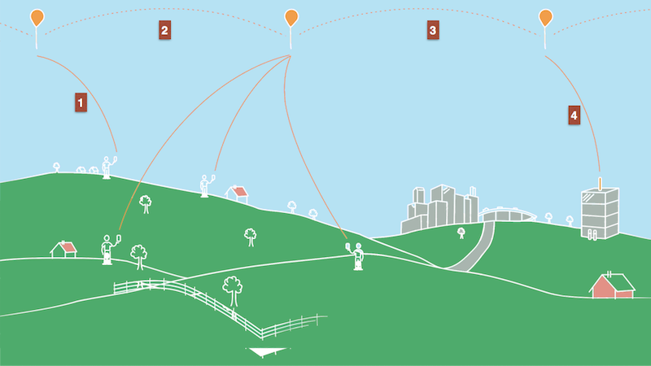

**ToDo** - Allex Magno Andrade

**ToDo** -https://travis-ci.com/POO29004-201702/lista-02-MagnoA.svg?token=y5SJj8AQ68rpr7NGNDQ9&branch=master

### Programação Orientada a Objetos - POO29004

#### Engenharia de Telecomunicações

##### Instituto Federal de Santa Catarina

## Projeto Loon

O [projeto Loon](https://x.company/loon) tem por objetivo oferecer serviço de conectividade à Internet para os locais mais remotos em nosso planeta. Para tal, é feito uso de um conjunto de balões que ficam navegando na estratosfera (aproximadamente 20Km de altura). 

Cada balão é munido com componentes para atuar com uma estação rádio base de telefonia celular, possui um identificador único, sensores GPS para determinar sua localização no globo (latitude, longitude e altitude), uma bateria e painéis solares, responsáveis por alimentar a bateria. Os balões não possuem mecanismos próprios de propulsão e sua movimentação é feita exclusivamente pelos ventos, seguindo a dinâmica da estratosfera. 

Os usuários em terra se conectam automaticamente no balão mais próximo e seus dados são roteados pelos demais balões até chegar no balão que estiver mais próximo de um ponto de acesso à Internet em terra (Veja os passos na figura acima). Sendo assim, um balão, ao ser lançado, sabe qual é o identificador do último balão que fora lançado anteriormente, denominado vizinho. 

Todos os balões, antes de serem lançados, conhecem a localização de todas as estações rádio base terrestre (ERB) existentes. Um balão, ao receber uma mensagem de um usuário, verifica se está próximo de uma ERB terrestre. Se não estiver, então encaminha a mensagem para o seu vizinho. Se estiver, então encaminha a mensagem para a ERB terrestre. O rádio de um balão só o possibilita comunicar com ERBs terrestre que estejam a no máximo 40Km de distância. Um balão só pode ser considerado vizinho de outro se estiver a no máximo 40Km de distância.

### Simplificações que deve assumir

* Em um determinado instante, todos os balões se movimentam para a mesma direção com uma mesma intensidade de força, tendo assim todos um mesmo deslocamento final
* Para o cálculo das distâncias não é necessário considerar a altitude

### Com base no detalhamento acima, faça:

1. Desenhe um diagrama de classes UML representando as classes e associações entre essas. Para cada classe é necessário indicar todos os atributos e somente os métodos essenciais para entendimento da classe
   1. O diagrama deverá ser entregue como uma figura PNG. Na raiz do repositório deve-se criar um arquivo [Resolucao.md](Resolucao.md) e fazer nesse uma referência para a figura do diagrama
2. Implemente em Java todas as classes do diagrama UML da questão anterior
3. Desenvolva um aplicativo Java (uma classe Java com método `main`) com um menu interativo que permita ao usuário realizar as seguintes operações
   1. Cadastrar estação rádio base terrestre
      1. A distância mínima entre uma ERB terrestre e outra deve ser de 40km. Não existe distância máxima. Ou seja, não é permitido cadastrar uma ERB que esteja a uma distância menor que 40km de qualquer outra ERB já cadastrada. A localização de cada ERB se por coordenadas geográficas (latitude, longitude)
   2. Remover estação rádio base terrestre
   3. Imprimir os dados de todas estações rádio base terrestres
   4. Lançar balão
      1. Se for o primeiro balão a ser lançado, então esse não terá vizinho. Se houver algum balão lançado, então o sistema deverá automaticamente preencher o identificador desse como sendo vizinho do balão que está para ser lançado
   5. Imprimir todos os dados de um balão específico
      1. Usuário fornece o identificador do balão
   6. Simular a movimentação dos balões
      1. Usuário fornece a unidade de deslocamento horizontal e essa é aplicada em todos os balões
   7. Imprimir o identificador e as coordenadas de todos os balões
   8. Simular o usuário enviando uma mensagem e essa sendo entregue em uma ERB
      1. O usuário fornecerá a sua localização e o conteúdo da mensagem a ser enviada. O sistema deverá automaticamente enviar a mensagem para o balão mais próximo do usuário
      2. Deve-se imprimir a rota percorrida pela mensagem até ser entregue na ERB (i.e. identificadores dos balões por onde passou a mensagem)
   9. Sair do programa

### Requisitos do projeto

* Crie um projeto gradle Java com a IDE IntelliJ
  * Marque a opção `Use auto-import`
  * Em `Project Location` escolha o diretório onde você fez o clone desse repositório do github classroom
* Arquivo `.gitignore`  para excluir arquivos do gradle, Java, Linux e Jetbrains IDE (IntelliJ)
* Arquivo **LICENSE** para indicar o licenciamento do código
* Testes de unidade com [JUnit4](https://github.com/junit-team/junit4/wiki/Assertions) para validar as implementações das principais classes
* Respeitar o conceito de encapsulamento, fazendo uso adequado dos modificadores de acesso
* Documentar os principais métodos seguindo a sintaxe do JavaDOC

### Bibliotecas que poderiam ser usadas no projeto

* [GeoTools The Open Source Java GIS Toolkit](http://geotools.org/)
  * Classe [GeodeticCalculator](http://docs.geotools.org/latest/javadocs/org/geotools/referencing/GeodeticCalculator.html) provê métodos para calcular a distância entre duas coordenadas. 
* [Java Geocalc](https://github.com/grumlimited/geocalc)
  * Biblioteca Java para cálculos com coordenadas geográficas

### Data para entrega: 17/09/2017
